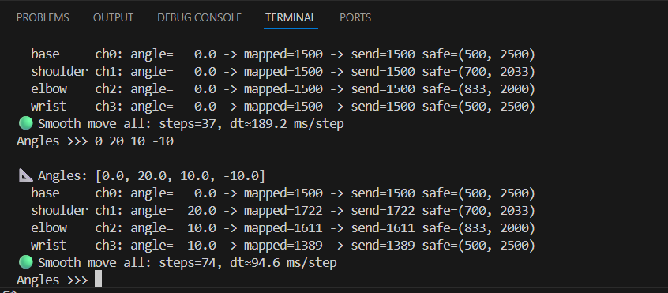

# SSC-32U Robotic Arm Control (Python + PySerial)

This project controls a robotic arm connected to a **Lynxmotion SSC-32U** servo controller using **Python** and **pyserial**.

The script:
1. Connects to SSC-32U through a COM port
2. Moves all servos to a **HOME / CENTER position (1500µs)**
3. Runs a simple **sequential movement task** (base → shoulder → elbow → wrist)
4. Closes the serial connection safely

---

## Requirements

- Windows (or Linux/Mac with correct port name)
- Python 3.x
- SSC-32U connected via USB
- External servo power supply connected to SSC-32U (USB alone is not enough to power servos)

---

## Install Dependencies

Install pyserial:

```bash
python -m pip install pyserial
````

---

## Hardware Setup

1. Connect SSC-32U to your PC using USB.
2. Power the servos using an external **5V–6V** supply (high current recommended).
3. Connect servos to SSC-32U channels:

* Channel 0 → Base
* Channel 1 → Shoulder
* Channel 2 → Elbow
* Channel 3 → Wrist

> Make sure servo plug orientation is correct: **GND / V+ / Signal**.

---

## Find Your COM Port (Windows)

1. Open **Device Manager**
2. Go to **Ports (COM & LPT)**
3. Identify SSC-32U port (example: **COM7**)

Update this in the script:

```python
controller = SSC32U(port="COM7", baudrate=9600)
```

---

## Run the Code

From your project folder:

```bash
cd Robotic_arm
```

```bash
python main.py
```

You should see output like:

* Connected to SSC-32U...
* Step 0) Going to HOME...
* Step 1) Base move...
* ...
* Done ✅
* Connection closed

---

## How the Motion Works

The SSC-32U is controlled using commands like:

```
#0 P1500 T2000
```

Meaning:

* `#0` → channel 0
* `P1500` → move to pulse 1500µs (center)
* `T2000` → take 2000ms (2 seconds) to reach the target
  ✅ Larger `T` = slower motion
  ✅ Smaller `T` = faster motion

---

## Modify Servo Channels

If your arm uses different channels, change these:

```python
CH_BASE = 0
CH_SHOULDER = 1
CH_ELBOW = 2
CH_WRIST = 3
```

---

## Modify Home Position (Recommended)

**1500µs is center**, but for robotic arms it may not always be safe.

If your arm hits the table or frame, use a custom home like:

```python
controller._send("#0 P1500 #1 P1700 #2 P1300 #3 P1500 T2000")
```

---

## Troubleshooting

### Arm works in FlowBotics but not in Python

* Close FlowBotics completely (it may lock the COM port).
* Try baudrates:

  * `9600` (common)
  * `115200` (also common)

### No servo movement

* Check external servo power (5–6V, enough current)
* Check common ground
* Check servo plug direction
* Check baudrate

### COM Port error

* Update `COM7` to your actual port from Device Manager

---

## Safety Notes

* Start with small moves and slow speeds (`T2000`)
* Avoid extreme ranges until you confirm the servo limits
* Robotic arm servos can draw high current — ensure your power supply is adequate

---

## File

* `main.py` → Main script
* `README.md` → This guide

flowchart TD
    A(Start)
    B(Input: pick_xyz, place_xyz, object_width_cm)
    C(Go HOME - arm HOME pulses - gripper OPEN)
    D{Is PICK reachable?}
    E(Solve IK for PICK)
    F{IK success?}
    G(Convert angles to PWM)
    H(Send PWM via Serial)
    I(Move arm to PICK)
    J(Close gripper to object width)
    K(Lift UP from pick)
    L{Is PLACE reachable?}
    M(Solve IK for PLACE)
    N{IK success?}
    O(Convert angles to PWM)
    P(Send PWM via Serial)
    Q(Move ABOVE PLACE)
    R(Lower to PLACE)
    S(Open gripper - release object)
    T(Lift UP from place)
    U(Return HOME - gripper OPEN)
    X(End)

    A --> B --> C --> D
    D -- No --> U --> X
    D -- Yes --> E --> F
    F -- No --> U --> X
    F -- Yes --> G --> H --> I --> J --> K --> L
    L -- No --> U --> X
    L -- Yes --> M --> N
    N -- No --> U --> X
    N -- Yes --> O --> P --> Q --> R --> S --> T --> U --> X


---
## 🎚️ Degree-Based Servo Control (Angle → PWM → Motion)

**File:** `check_each_angle_and_servo.py`

This file implements **degree-based control** for the robotic arm using the
**SSC-32U servo controller**.

Instead of sending raw PWM values, the user provides **joint angles in degrees**.
These angles are internally converted into **safe PWM signals** before being
sent to the hardware.

---

## 📐 Angle Convention

All joints follow the same angle reference:

- **-90°** → Maximum rotation in one direction  
- **0°** → Neutral / Center position  
- **+90°** → Maximum rotation in the opposite direction  

**1500 µs PWM is treated as the center (0°)** for all joints.

Any angle outside the range **[-90°, +90°]** is automatically clamped for safety.

---

## 🔄 Global Angle → PWM Mapping Rule

A single global rule is used to convert angles into PWM values.

| Angle (deg) | PWM (µs) |
|------------|----------|
| -90° | 500 |
| 0° | **1500 (Center)** |
| +90° | 2500 |

This mapping guarantees:
- Symmetric motion
- Predictable behavior
- Easy calibration

```python
def angle_to_pwm(angle_deg):
    a = clamp(angle_deg, -90.0, 90.0)

    if a < 0:
        pwm = 1500 + (a / 90.0) * (1500 - 500)
    else:
        pwm = 1500 + (a / 90.0) * (2500 - 1500)

    return int(round(pwm))
```
---
## 🧭 Rotate Arm Using All Joint Angles Together

**Python File:** `All_angles_to_rotate_arm.py`  
**Output Image:** `All_angles_to_rotate_arm.png`

This script allows the robotic arm to move to a desired position by providing
**all four joint angles at the same time**.

Instead of moving one servo at a time, the arm moves **base, shoulder, elbow,
and wrist together smoothly**, reaching the target pose in a coordinated way.

---

## 🎯 What This Script Does

- Takes **4 joint angles** as input:
  - Base
  - Shoulder
  - Elbow
  - Wrist
- Converts each angle into a **PWM value**
- Applies **joint-specific safety limits**
- Moves **all servos together smoothly**
- Prevents unsafe or out-of-range motion

This makes the movement look more **natural and robotic-arm–like**, similar to
FlowBotics behavior.

---

## 📐 Angle Input Rule

Each joint follows the same rule:

- **-90°** → Minimum rotation  
- **0°** → Center position (**1500 PWM**)  
- **+90°** → Maximum rotation  

## 🧭 Rotate Arm Using All Joint Angles Together

**Python File:** `All_angles_to_rotate_arm.py`

Below image shows the output pose of the robotic arm when all four joint angles
are provided together.



---
## 📊 Angle to PWM Mapping

The image below illustrates how joint angles are converted into PWM values.


---
# 🔧 Inverse Kinematics – Angle Definitions (3-DOF Arm)

This section explains **what each angle represents** in the inverse kinematics (IK) solution for a **planar 3-DOF robotic arm**, solved **after base rotation**.

---

## 🟦 Coordinate Input (IK Plane)

After base rotation, the arm motion is reduced to the **j–k plane**.

\[
j = \sqrt{x^2 + y^2} \quad \text{(horizontal distance)}
\]

\[
k = z \quad \text{(vertical height)}
\]

All inverse kinematics calculations are performed in this **2D plane**.

---

## 1️⃣ Angles Used in IK (Step by Step)

---

### 🔹 α (Alpha) – End-Effector / Tool Angle

Angle of the tool (wrist) **relative to the horizontal**.

- Chosen by the user  
- Controls **tool orientation**, not position  

**Example:**

\[
\alpha = -68^\circ
\]

---

### 🔹 θ₁₂ (Theta₁₂) – Line-of-Sight Angle to Wrist Center

\[
\theta_{12} = \tan^{-1}\left(\frac{m}{n}\right)
\]

- Angle between the horizontal axis and the line from **base → wrist center**
- Pure **geometric angle**

---

### 🔹 θ₁₃ (Theta₁₃) – Triangle Correction Angle

\[
\theta_{13} =
\cos^{-1}\left(
\frac{L_2^2 - L_1^2 - l^2}{-2 L_1 l}
\right)
\]

- Comes from the triangle formed by **\(L_1\), \(L_2\), and \(l\)**
- Adjusts the shoulder so the elbow reaches the wrist center

---

### 🔹 φ₁ (Phi₁) – Shoulder Joint Angle ✅

\[
\phi_1 = \theta_{12} + \theta_{13}
\]

- **Actual SHOULDER servo angle**
- Applied after mechanical offset

---

### 🔹 φ₂ (Phi₂) – Internal Elbow Triangle Angle

\[
\phi_2 =
\cos^{-1}\left(
\frac{l^2 - L_1^2 - L_2^2}{-2 L_1 L_2}
\right)
\]

- Internal angle of the triangle at the elbow  
- ❌ **Not a servo angle**

---

### 🔹 θ₂ (Theta₂) – Elbow Joint Angle (Servo) ✅

\[
\theta_2 = \phi_1 + \phi_2 - 180^\circ
\]

- **Actual ELBOW servo angle**

**Why subtract \(180^\circ\)?**

- Triangle angles are **internal**
- Servo zero is typically aligned **straight along the arm**

---

### 🔹 φ₃ (Phi₃) – Wrist Joint Angle ✅

\[
\phi_3 = (180^\circ - \theta_2) + \alpha
\]

**Purpose:**
- Cancels elbow rotation  
- Adds tool orientation (\(\alpha\))  
- Keeps end-effector pointing correctly  

---

## 2️⃣ Conceptual Meaning of Angles

- **φ₁** → Shoulder angle from horizontal  
- **θ₂** → Elbow bend angle  
- **φ₃** → Wrist rotation  
- **α** → Tool orientation  
- **(m, n)** → Wrist center coordinates  

*(Matches Desmos visualization)*

---

## 3️⃣ One-Line Summary (Very Important)

| Symbol | Meaning |
|------|--------|
| φ₁ | Shoulder joint angle |
| θ₂ | Elbow joint angle (servo) |
| φ₃ | Wrist joint angle |
| α | Tool orientation |
| θ₁₂, θ₁₃ | Helper geometry angles |
| φ₂ | Internal triangle angle (not a servo) |

---

## ✅ Key Takeaway

Only **three angles are sent to motors**:

- **φ₁ → Shoulder**
- **θ₂ → Elbow**
- **φ₃ → Wrist**

All other angles exist **only for geometric computation**.

---
🧭 Mapping IK Angles to Arm Servo Angles

This section explains how inverse kinematics (IK) angles are converted into
actual servo angles that the robotic arm can move to.

Python file: try_map_angle_to_arm_angle.py

📐 Coordinate Meaning (Very Important)

Before solving inverse kinematics, the 3D target point:

(x, y, z)

is reduced to a 2D plane.

j → horizontal length (reach)
k → vertical height
Computation
j = sqrt(x² + y²)
k = z
Meaning

j represents how far the arm must reach forward

k represents how high or low the arm must move

The IK solver works entirely in the j–k plane to find the arm joint angles.

🔁 Final Angle Mapping (IK → Servo Angles)

After solving the IK equations, the resulting geometry angles are mapped to
actual servo angles as shown below.

# FINAL SERVO ANGLES


shoulder_final = phi1_deg - 90.0   # shoulder servo
elbow_final    = -theta2_deg       # elbow servo
wrist_final    = alpha_deg         # wrist servo
🔍 Explanation of Each Mapping
Shoulder Servo (shoulder_final)
shoulder_final = phi1_deg - 90

The shoulder servo zero position is aligned vertically

Subtracting 90° converts the IK geometry angle to the servo reference frame

Elbow Servo (elbow_final)
elbow_final = -theta2_deg

The elbow joint rotation direction is inverted mechanically

The negative sign corrects the rotation direction

Wrist Servo (wrist_final)
wrist_final = alpha_deg

The wrist directly follows the tool orientation angle

This keeps the end-effector pointing in the desired direction

✅ Summary

j → horizontal reach (length)

k → vertical position (height)

IK is solved in the j–k plane

Geometry angles are mapped to servo angles

Only mapped servo angles are sent to the hardware

---

🧠 Coordinate to Arm Control (Without Individual Servo Commands)

Python File: coordinate_to_arm_without_each_servo.py

This script moves the robotic arm directly from Cartesian coordinates
without manually controlling each servo one by one.

🎯 Purpose of This File

This program allows the user to:

Enter a target position (x, y, z)

Enter a wrist orientation angle

Automatically compute inverse kinematics (IK)

Convert angles into PWM signals

Move the robotic arm smoothly and safely

👉 The user does not need to control base, shoulder, elbow, and wrist separately.

---


task-pick
place
object dimention change to pick